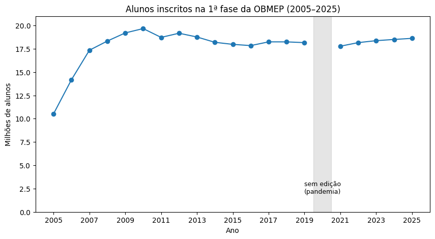
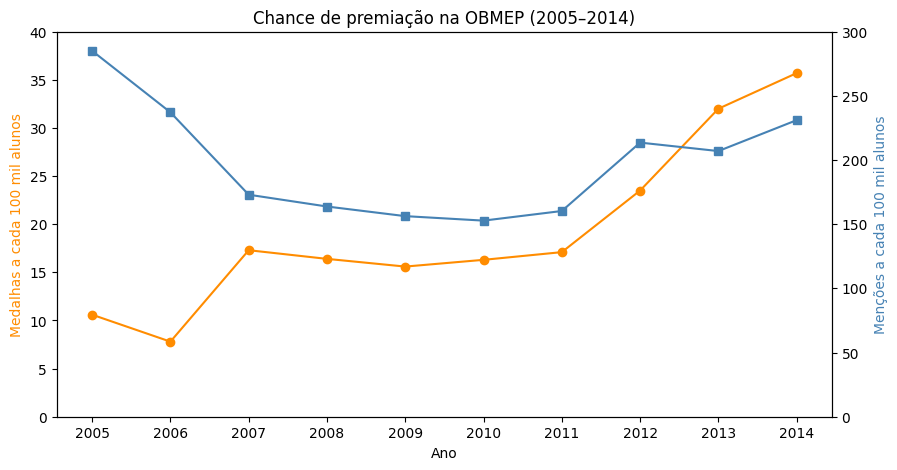

# Evolução da OBMEP (2005–2025)

Análise em Python/pandas da Olimpíada Brasileira de Matemática das Escolas Públicas: como evoluiu a participação dos alunos e a chance de premiação ao longo dos anos.

## Principais resultados

- **Participação:** de 10,5 milhões de alunos em 2005 para 18,6 milhões em 2025 (+77%). O pico foi em 2010 (19,7 milhões); depois, a participação estabilizou em torno de 18 milhões. A cobertura chegou a 99,93% dos municípios.
- **Medalhas:** a chance de ganhar medalha mais que triplicou entre 2005 e 2014 (de 10,6 para 35,7 a cada 100 mil alunos).
- **Menções honrosas:** a chance caiu de 285 para 231 a cada 100 mil alunos no mesmo período.

## Revisão de uma análise anterior

Uma primeira versão deste projeto concluiu que ganhar medalha tinha ficado mais difícil. O erro veio de usar uma coluna de total que misturava medalhas e menções honrosas (cerca de 97% menções). Separando as categorias e usando a série completa de participantes, a conclusão se inverteu.

## Tratamento dos dados

- Não houve edição em 2020 (pandemia). Os gráficos mostram essa lacuna em vez de ligar 2019 a 2021.
- Em 2014, o total de premiados da fonte não bate com a soma das categorias (diferença de 2.880). O problema foi documentado, e as análises usam a soma de ouro + prata + bronze.
- Os números coletados (ponto de milhar, porcentagem com vírgula) foram limpos no próprio pandas.

## Como rodar

1. Abra o notebook `analise_obmep.ipynb` no Google Colab.
2. Na primeira célula de código, envie os arquivos `obmep.csv` e `medalhas_obmep.csv`.
3. Use **Ambiente de execução → Executar tudo**.

## Fontes

- Participantes, escolas e municípios: [OBMEP em Números](https://www.obmep.org.br/em-numeros.htm) (site oficial)
- Medalhas 2005–2014: tabela histórica de edições da OBMEP (Olimpédia)

## Ferramentas

Python, pandas, matplotlib, Google Colab
